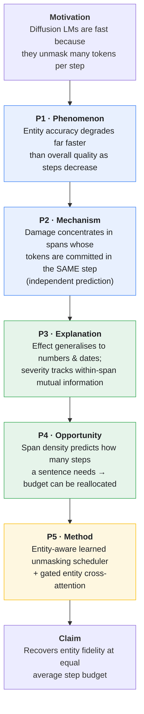
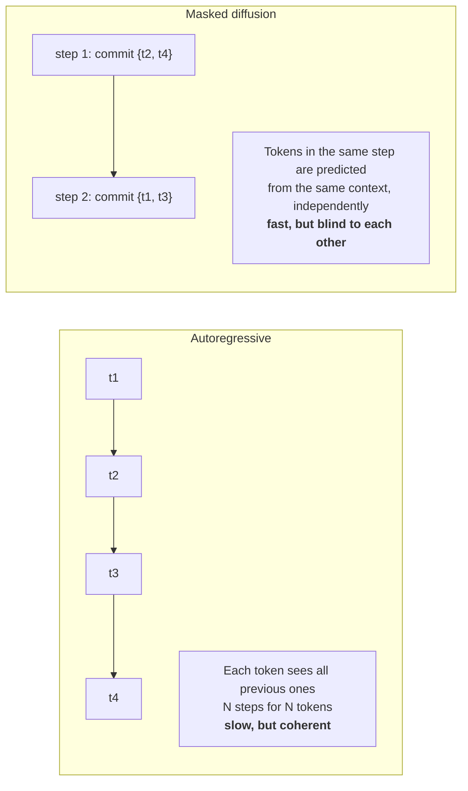
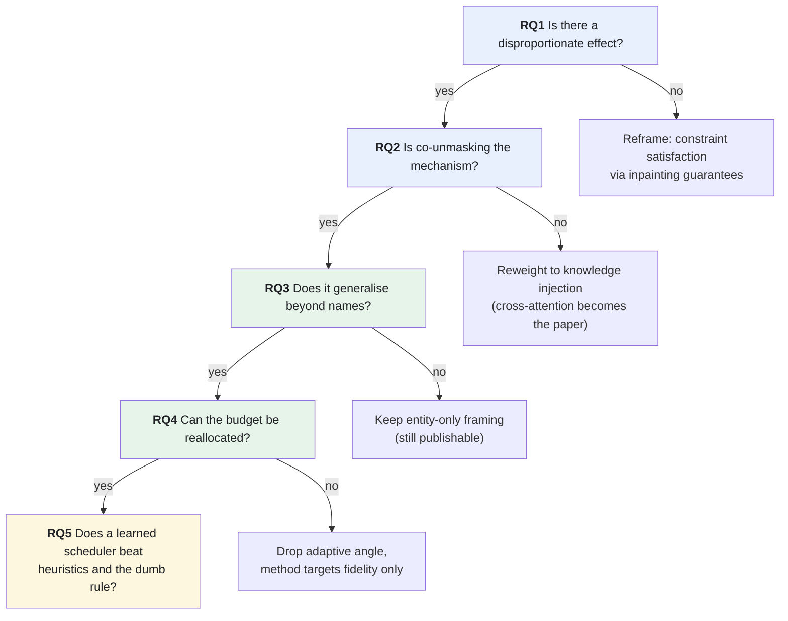
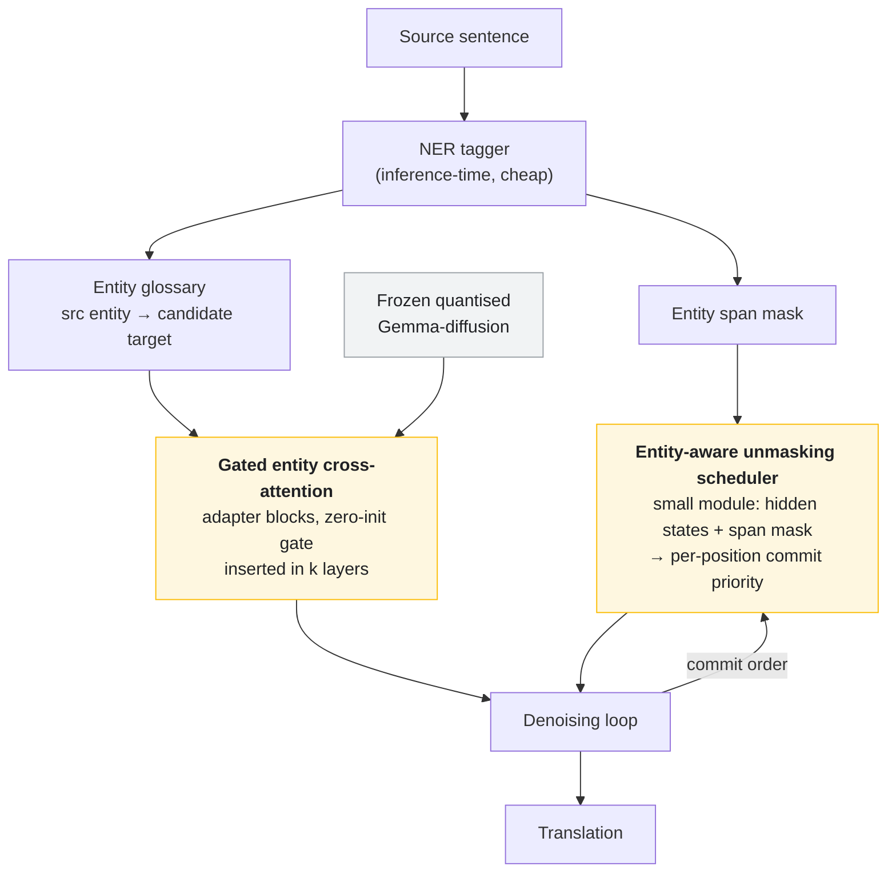
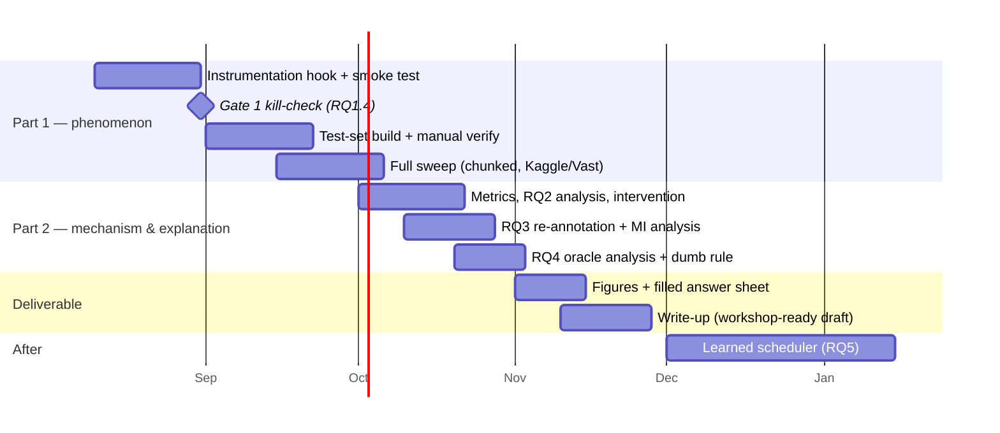

# Paper Proposal (Master Document)

## Entity-Aware Decoding for Diffusion Machine Translation
### Why parallel unmasking breaks names, and how to fix it without losing speed

**Version:** consolidated — supersedes all earlier fragments (implementation plan, answer sheet, extension proposal remain as *child* documents).
**Target:** ARR cycle, early 2026 → ACL/EMNLP/NAACL main or Findings. Interim milestone: complete empirical result (Parts 1–2) written up by **end of November 2026**.
**Compute:** self-funded, ~$25–30 total on Vast.ai interruptible + free Kaggle quota.

---

## 0. The whole paper in one sentence

> Diffusion language models translate fast because they guess many tokens at once — but tokens guessed in the same step cannot see each other, so named entities break; we prove this, explain why, and fix it without giving up the speed.

Everything below is that sentence unfolded. If you ever feel lost in this project, come back to this line.

---

## 1. The narrative chain

Each link exists only because the previous one holds. This is the paper's spine and the order of work.

**Scope by date:** blue = done by October. Green = done by November (this is the interim deliverable). Yellow = after November, for the ARR submission.

---

## 2. Background and the gap

**Where this comes from.** Our first attempt used SeqDiffuSeq with adaptive noise cancelling. It failed to transfer beyond en→de — the standard fate of continuous embedding-space diffusion trained from scratch, which has no multilingual pretraining to lean on. Diffusion LLMs adapted from strong pretrained backbones (Gemma-diffusion, Dream, LLaDA) remove that failure mode, so we move there. The adaptive-schedule idea survives the move: in discrete masked diffusion the analogue of a noise schedule is the **unmasking order**.

**Two decoding paradigms.**

**The gap.** Terminology-constrained MT is mature on the autoregressive side (WMT terminology tasks, constrained beam search). Non-autoregressive MT studied the independence problem extensively in 2019–2021 (the "multimodality problem", glancing transformers, CTC-based NAT) — but without pretrained multilingual backbones and without an iterative refinement loop. Current diffusion-LLM work studies decoding order generically (confidence, entropy, planners), but not **constraint-awareness**. Our contribution sits exactly in that hole: what happens to spans with a single correct realisation when a pretrained diffusion LM decodes them in parallel, and what to do about it.

> ⚠️ **Mandatory before submission:** a fresh literature pass. This area moves monthly, and the assistant's knowledge ends ~May 2026. Search specifically for entity/constraint-aware decoding in diffusion LMs, and for parallel-decoding independence analyses published after that date.

---

## 3. What we must answer — the question breakdown

This is the core of the proposal. Five research questions; each has the sub-questions that must be answered, how each is measured, and what the answer *changes*.

### RQ1 — Does parallel unmasking corrupt entities disproportionately?

| # | Question to answer | How | Answer lands in |
|---|---|---|---|
| 1.1 | What is overall quality at each step count T? | COMET + chrF++ over T ∈ {L, L/2, L/4, L/8, L/16, default} | Answer sheet Q1.1 |
| 1.2 | What is entity accuracy at each T? | normalised exact match + entity-chrF | Q1.2 |
| 1.3 | Is the entity drop ≥2× the quality drop? | both curves normalised to T=L, ratio + bootstrap CI | Q1.3 — **headline number** |
| 1.4 | Is the AR control immune? | same test set, lineage-matched AR model, same quantisation | Q1.4 — **kill-check** |

**Why 1.4 decides everything:** if the AR model is also bad at entities, the problem is model knowledge, not decoding, and the scheduler has nothing to fix.

### RQ2 — Is same-step commitment the causal mechanism?

| # | Question to answer | How | Answer lands in |
|---|---|---|---|
| 2.1 | Do co-unmasked spans corrupt more than split-step spans *at the same T*? | decoder logs commit-step per token; two-proportion test + logistic regression controlling span length & token frequency | Q2.1 |
| 2.2 | Is the effect worst for long, rare spans? | stratified table (span length × frequency bucket) | Q2.2 |
| 2.3 | Does *forcing* a split repair the entity? | intervention run: force co-unmask vs force split on ~100 sentences at fixed T | Q2.3 — **causal evidence, Figure 2** |

**Why 2.3 matters:** 2.1 is observational (which spans co-unmask is partly incidental). 2.3 manipulates the variable directly. It is ~30 lines of decoding code and it pre-validates the entire method before any training happens.

### RQ3 — Does the effect generalise beyond names?

| # | Question to answer | How | Answer lands in |
|---|---|---|---|
| 3.1 | Do numbers show the same degradation signature? | Arabic-digit spans, value-normalised alignment (free — no NER needed) | Figure C |
| 3.2 | Do dates? | regex + ISO normaliser, day/month order per language | Figure C |
| 3.3 | Does severity track within-span predictability? | estimate within-span conditional entropy / MI from the model's own logits under teacher forcing; correlate with corruption slope | Figure D — **the explanation** |
| 3.4 | Which error types dominate, per category? | manual typology, 50 errors per pair (garbled mix / wrong-but-fluent / omission / bad transliteration) | Q3 table |

**Zero marginal GPU cost:** this is re-annotation and re-analysis of generations RQ1–RQ2 already produced.

### RQ4 — Can we exploit it? (step budget reallocation)

| # | Question to answer | How | Answer lands in |
|---|---|---|---|
| 4.1 | Does each sentence have a "T-elbow" (smallest T within noise of T=L)? | post-hoc over the existing sweep | oracle analysis |
| 4.2 | Does span density predict the elbow **beyond sentence length**? | regression: density, per-category counts, length, mean confidence | **gate** — if length dominates, stop here, $0 spent |
| 4.3 | What could an oracle allocator save? | assign each sentence its elbow-T; report average-step saving at equal entity accuracy | headline statistic |
| 4.4 | Does a dumb rule realise part of that gain at matched budget? | T(s) = clip(a + b·entity_subwords), constants fit so average tokens/step equals the fixed-T baseline exactly | Figure E, Pareto plot |

**Budget matching is non-negotiable** — an adaptive method that quietly spends more steps proves nothing.

### RQ5 — Does the method work? (after November)

| # | Question to answer | How |
|---|---|---|
| 5.1 | Does a learned entity-aware scheduler beat confidence / entropy / margin heuristics? | same budget, same model, entity accuracy + COMET |
| 5.2 | Does it beat the dumb rule from 4.4? | the oracle–rule gap is the headroom being claimed |
| 5.3 | Does gated cross-attention add fidelity on top of ordering alone? | ablation: scheduler only, cross-attn only, both |
| 5.4 | Does it beat free inference-only baselines (glossary prompting, entity inpainting)? | **the "why not just prompt it?" defence — mandatory table row** |
| 5.5 | Does a Gemma-trained scheduler transfer zero-shot to Dream? | tests whether order policies are properties of the paradigm, not the checkpoint |

---

## 4. Proposed method (Part 3, post-November)

Two additive components, so the quantised base stays frozen and trainable parameters stay tiny.

**Scheduler — three possible training regimes,** to be chosen by what RQ2/RQ4 show:

| Variant | Idea | Cost | When |
|---|---|---|---|
| (c) heuristic-parameterised | module outputs per-span commit-together flags + confidence thresholds over a confidence backbone | trivial; trains on decoding traces already logged | **build first** |
| (a) oracle imitation | search good unmasking orders offline, distil the policy | moderate | if (c) shows signal |
| (b) RL on entity-accuracy + COMET reward | most general, noisiest | high | future work |

**Design constraint for transfer (RQ5.5):** prefer model-agnostic inputs (confidence distributions, span masks, positions) over raw hidden states — transfer then holds by construction. Ablate both input sets.

**Why quantisation forces additivity:** you cannot backprop into 4-bit weights or perform surgery on them. Everything new is full-precision, zero-initialised, and trainable; the base is frozen. If full surgery ever becomes necessary, it requires bf16 weights and a re-quantisation step at the end.

---

## 5. Experimental setup

**Models — lineage-matched pairs.** The only difference within a pair must be the decoding paradigm.

| Role | Model | Notes |
|---|---|---|
| Primary diffusion | Gemma-diffusion (quantised) | the model we build on |
| Primary AR control | the exact Gemma checkpoint it was adapted from, same quantisation, same prompt template | read `base_model` from the config; verify identical tokenizer |
| Generality diffusion | Dream 7B | AR-adapted from Qwen2.5; strong zh coverage |
| Generality AR control | Qwen2.5 7B Instruct, same quantisation | second lineage-matched pair |
| Optional | LLaDA 8B Instruct | from-scratch dLLM; appendix only |
| Context footnote | NLLB-200 | quality ceiling reference, not a control |

**Languages.** zh→vi (headline; Sino-Vietnamese name conversion means copy-through fails — this is what differentiates us from the en–de-centric literature), en→vi, en→de (sanity anchor against existing results).

**Data.** FLORES-200 devtest in full (needed for number/date density) + an entity-rich subset from NTREX, 500–1,000 sentences per pair, oversampling multi-token person names. Span annotation schema covers PER/ORG/LOC/NUM/DATE. Manual verification of 100 alignments per pair; **alignment error ≤10% or the test set is not frozen.**

**Baselines.** Confidence-based unmasking (default) · entropy-based · margin-based · glossary prompting (soft constraint) · entity inpainting/anchoring (hard constraint, free) · AR constrained decoding with glossary.

---

## 6. Timeline to November

**Milestone definition — "results in November"** = RQ1–RQ4 answered, Figures A–E drawn, answer sheet filled, draft written. That is a self-contained workshop paper and two-thirds of the ARR submission.

**The single hardest task is the instrumentation hook** (logging which step each token was committed in). It is the only genuinely unpredictable item. If it is still fighting after ~10 days, fall back to reimplementing the masked-diffusion sampling loop directly (~80 lines).

**The single most under-estimated task is manual entity verification.** It does not parallelise and cannot be rushed without poisoning every downstream number. Book real hours for it.

---

## 7. Budget

| Item | GPU-hrs (4090 interruptible ≈ $0.25/hr) | Cost |
|---|---|---|
| Phase 0 + hook development | 3–5 | ~$1.50 |
| Gate 1 kill-check | 1 | ~$0.30 |
| Full sweep (4 models × 3 pairs × 6 T) | 20–30 | $5–9 |
| Intervention runs (RQ2.3) | 2–3 | ~$1 |
| RQ3 (analysis only; one logit pass) | ~1 | ~$0.50 |
| RQ4 Stage B allocator run | 4–6 | $1.50–4 |
| Scheduler training (frozen base, tiny module) | 5–10 | ~$2 |
| Buffer ×1.5 for re-runs and mistakes | — | ~$8 |
| **Total** | | **≈ $25–30** |

Free Kaggle quota (30 GPU-hrs/week) covers hook development and Gate 1 at $0. Vast practices: interruptible instances, checkpoint every 100 sentences, stage model + results through free-tier object storage (R2/B2), filter hosts for >500 Mbps, public data and open checkpoints only on rented machines, repo private with a narrowly-scoped token in an environment variable.

---

## 8. Risks

| Risk | Mitigation |
|---|---|
| Instrumentation hook not exposable | reimplement sampling loop (~80 lines); losslessness unit test either way |
| Instrumentation changes outputs | **mandatory test:** byte-identical generation with/without hook at fixed seed |
| zh→vi entity alignment too noisy | shrink to 300 fully hand-verified sentences rather than ship a noisy 1,000 |
| Quantisation confounds rare-token results | run one pair in bf16 at two T values; otherwise quantise the AR control identically and state the limitation |
| Density–length confound in RQ4 | length included as a regressor; length-only allocator reported as ablation |
| Sparse NUM/DATE counts | full FLORES devtest is news-domain and number-rich; if <150 aligned instances, pool pairs and report counts honestly |
| "Why not just prompt it?" | inference-only baselines (inpainting, glossary) in the main table; beating them is the justification for architecture work |
| Concurrent publication | the phenomenon+mechanism result stands on its own; fresh literature pass before submission |

---

## 9. Contribution statement (draft)

1. First systematic evidence that parallel unmasking in diffusion LMs **disproportionately corrupts constraint-critical spans**, with the mechanism pinned to same-step independent commitment via a controlled intervention.
2. A **predictability account** — corruption severity tracks within-span mutual information — unifying names, numbers and dates under one explanation.
3. A budget-matched demonstration that **constraint-density-adaptive step allocation** Pareto-improves the speed–fidelity trade-off, recovering fidelity without surrendering the speed advantage that motivates diffusion LMs.
4. An **entity-aware unmasking scheduler + gated entity cross-attention** that beats heuristic orders, rule-based allocation, and inference-only constraint baselines at equal budget.
5. A manually verified, span-annotated **zh→vi / en→vi / en→de evaluation suite** including Sino-Vietnamese name mappings, released publicly.

---

## 10. Explicitly out of scope

- Training a diffusion LM from scratch.
- Full architecture surgery on the base model (blocked by quantisation; additive modules only).
- A general "constraint-critical span detector" — we generalise the *phenomenon*, not the *fix*. Entities are detected with an off-the-shelf tagger.
- Block-diffusion (BD3-LM) style models — AR-within-blocks muddies the co-unmasking analysis. One sentence in related work.
- Chinese numeral-word and spelled-out-number alignment — labelled special category, qualitative discussion only.

---

## 11. Child documents

| Document | Role |
|---|---|
| `IMPLEMENTATION_PLAN.md` | phase-by-phase engineering brief for Claude Code, with acceptance checks |
| `motivating_experiment_answer_sheet.md` | the blanks that RQ1–RQ2 must fill; contains the decision table |
| `proposal_extensions_2_3.md` | detailed design for RQ3 and RQ4 |

**This week:** get one instrumented translation working — one zh→vi sentence, with a log of which step each output token was committed in. Everything in every document waits behind that.
